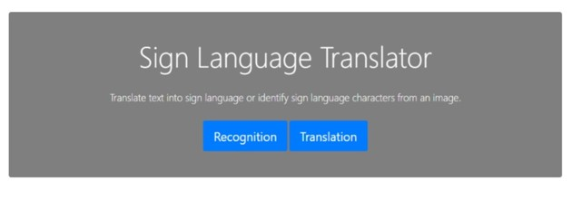
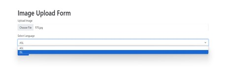
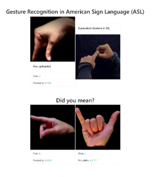
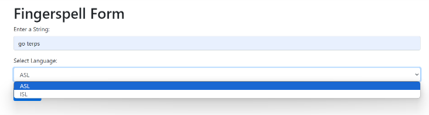
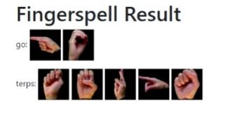

# Sign Language Gesture Recognition Web Application

This project aims to develop a web application for recognizing American Sign Language (ASL) and Indian Sign Language (ISL) gestures using Convolutional Neural Network (CNN) models. We explored several CNN model performances for both languages and built a web application to help users utilize these trained models effectively.

## Features

- **Model Exploration**: We evaluated the performance of multiple CNN models for both ASL and ISL gesture recognition. Through extensive experimentation, we identified models that achieved high accuracy and robustness across various gestures and conditions.

- **Performance Metrics**: The web application provides insights into the performance of each CNN model, including accuracy rates, inference speed, and error analysis. This information helps users understand the strengths and limitations of the deployed models.

- **Web Application**: We developed a user-friendly web application that provides seamless access to the trained CNN models. Users can upload images containing ASL or ISL gestures and receive instant recognition results.

- **Accessibility**: Our goal is to make sign language recognition accessible to a wide range of users. The web application features intuitive navigation and clear instructions, ensuring a positive user experience for individuals with varying levels of technical expertise.
## Models

The following CNN models are included in the project:

- Model 1: MobileNetV3
- Model 2: InceptionV2
- Model 3: DenseNet201
- Model 4: ResNet101
- Model 5: VGG16
- Model 6: Custom CNN

## Dataset

### American Sign Language (ASL)

Source: [https://www.kaggle.com/datasets/ayuraj/asl-dataset/data](https://www.kaggle.com/datasets/ayuraj/asl-dataset/data)

### Indian Sign Language (ISL)

Source: [https://www.kaggle.com/datasets/prathumarikeri/indian-sign-language-isl](https://www.kaggle.com/datasets/prathumarikeri/indian-sign-language-isl) 

## Web Application

Built using *Flask* and *ngrok*. 

**Landing Page**

### Recognition Functionality

**Form**

**Output**

### Translation Functionality

**Form**

**Output**

