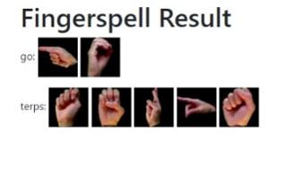

# Sign Language Recognition Web Application

This repository hosts a comprehensive project aimed at developing a web application for recognizing American Sign Language (ASL) and Indian Sign Language (ISL) gestures using Convolutional Neural Network (CNN) models. We've explored various CNN models' performances for both languages and built a user-friendly web interface to facilitate efficient utilization of these trained models.

## Features

- **Model Exploration**: We've rigorously evaluated the performance of multiple CNN models for ASL and ISL gesture recognition. Through extensive experimentation, we've identified models that exhibit high accuracy and robustness across diverse gestures and conditions.

- **Performance Metrics**: Our models were meticulously trained, and performance metrics such as accuracy and loss were recorded and analyzed to select the best-performing models for our dataset.

- **Web Application**: We've developed an intuitive web application that provides seamless access to the trained CNN models. Users can effortlessly upload images containing ASL or ISL gestures and receive instant recognition results.

- **Accessibility**: Our primary aim is to make sign language recognition accessible to a wide audience. The web application boasts intuitive navigation and clear instructions, ensuring a positive user experience for individuals with varying levels of technical expertise.

## Models

The following CNN models are included in this project:

- Model 1: MobileNetV3
- Model 2: InceptionV2
- Model 3: DenseNet201
- Model 4: ResNet101
- Model 5: VGG16
- Model 6: Custom CNN

## Dataset

### American Sign Language (ASL)

Source: [ASL Dataset on Kaggle](https://www.kaggle.com/datasets/ayuraj/asl-dataset/data)

### Indian Sign Language (ISL)

Source: [ISL Dataset on Kaggle](https://www.kaggle.com/datasets/prathumarikeri/indian-sign-language-isl)

## Usage

It is recommended to utilize Google Colaboratory to run the scripts as all the necessary libraries are pre-installed there. If running the application locally, install the required dependencies using the following command:

```bash
pip install -r requirements.txt
```

### Steps to Run:

1. **Download Datasets**: Refer to the links provided in the [*Dataset*](#dataset) section to download the ASL and ISL datasets.

2. **Preprocessing**: 
   - Trim the ISL dataset to have 70 samples per class and copy images for *class 0* from the ASL dataset as it represents the same gesture in both languages.
   - Split datasets into training and testing datasets by running the `reduce.ipynb` script.

3. **Split Datasets**: 
   Run the `splitter.ipynb` script to further divide the datasets into training and testing sets.

4. **Training Models**: 
   Execute the respective scripts listed in the [Models](#models) section to train different CNN models. Detailed instructions can be found within each script.

5. **Testing Models**: 
   Run the `tester.ipynb` script and follow the provided instructions to evaluate the trained CNN models.

6. **Launch Web Application**: 
   Start the web application by running the `app.ipynb` script.

## Web Application

**Landing Page**


### Gesture Recognition Functionality

**Input Form**


**Recognition Output**


### Finger Spelling Translation Functionality

**Input Form**


**Translation Output**

